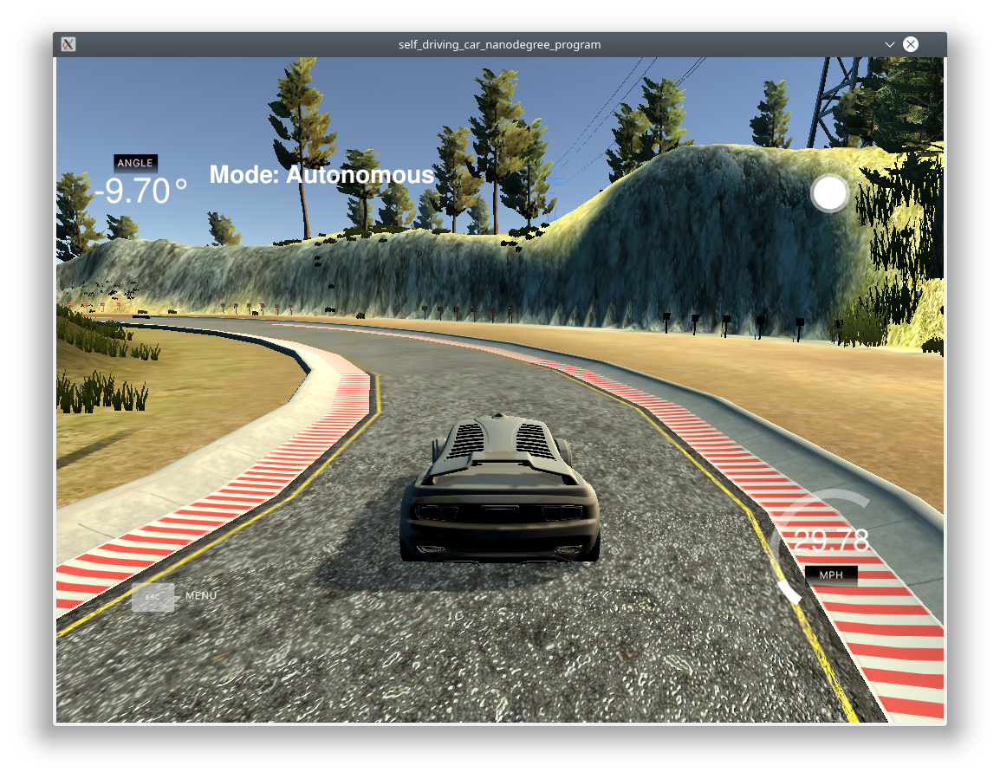

# PID control for self-driving car

## Summary

- Implementation of a PID controller to control velocity and steering angle of a car.
- Connect the controller to a car simulator.
- Check the behavior with different values of the PID parameters.
- Optimize the PID parameters with coordinate ascent to have a minimum mse.

## Problem

The PID controller should control the steering angle so that the car has a safe behavior. The only controller input is the cross track error (CTE).

Since no car model is used there is also no additional feed forward control. So in curves the CTE increases directly with the change of the trajectory.

## Solution

### Manual parameter initialization

First a manual parameter optimization was done so that the car drives safely over the complete track.

1) Only the proportional term was used and the parameter was set so that the car drives with a stable oszillation on the straight part of the track.
2) The derivative term was changed so that the oscillations are damped and the car has a straight trajectory on the straight parts of the track.
3) The integral term was changed to compensate any drift.

After that it was necessary to change the parameters till the behavior was also relatively good during the curves. Since the controller has no information about the trajectory no feed forward term can be used and the PID controller has to find the new steering angle in the curves only from the cross track error. So the result is very bad and has many sharp turns and oscillations.

The parameter of the integral term seemed not to have a big change in the controller behavior but was later set to a relatively high value during the automatic parameter search.

Manual result:

Kp | Kd | Ki
---|----|---
0.08 | 0.1 | 0.02

### Parameter search with coordinate ascent

To find better PID parameters a automatic search was done.
Starting with the manual parameters the car was driven in the simulator and the sum of an error measure was calculated. Then it was searched in the direction of one of the coordinates to find better behavior.

The error measure finally used was cte^4 which gives a high penaltiy on higher cte. Using only cte^2 gave too much oscillations during the curves.

Final result:

Kp | Kd | Ki
---|----|---
0.216005 | 0.108957 | 0.128885

## Result

The car drives safely the complete track but the oscillations are much too strong for a human passenger.



---

# Dependencies

* cmake >= 3.5
 * All OSes: [click here for installation instructions](https://cmake.org/install/)
* make >= 4.1(mac, linux), 3.81(Windows)
  * Linux: make is installed by default on most Linux distros
  * Mac: [install Xcode command line tools to get make](https://developer.apple.com/xcode/features/)
  * Windows: [Click here for installation instructions](http://gnuwin32.sourceforge.net/packages/make.htm)
* gcc/g++ >= 5.4
  * Linux: gcc / g++ is installed by default on most Linux distros
  * Mac: same deal as make - [install Xcode command line tools]((https://developer.apple.com/xcode/features/)
  * Windows: recommend using [MinGW](http://www.mingw.org/)
* [uWebSockets](https://github.com/uWebSockets/uWebSockets)
  * Run either `./install-mac.sh` or `./install-ubuntu.sh`.
  * If you install from source, checkout to commit `e94b6e1`, i.e.
    ```
    git clone https://github.com/uWebSockets/uWebSockets 
    cd uWebSockets
    git checkout e94b6e1
    ```
    Some function signatures have changed in v0.14.x. See [this PR](https://github.com/udacity/CarND-MPC-Project/pull/3) for more details.
* Simulator. You can download these from the [project intro page](https://github.com/udacity/self-driving-car-sim/releases) in the classroom.

There's an experimental patch for windows in this [PR](https://github.com/udacity/CarND-PID-Control-Project/pull/3)

## Basic Build Instructions

1. Clone this repo.
2. Make a build directory: `mkdir build && cd build`
3. Compile: `cmake .. && make`
4. Run it: `./pid`. 
